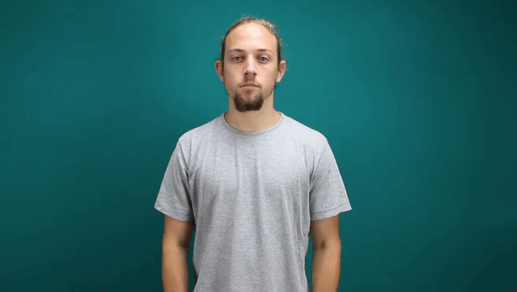
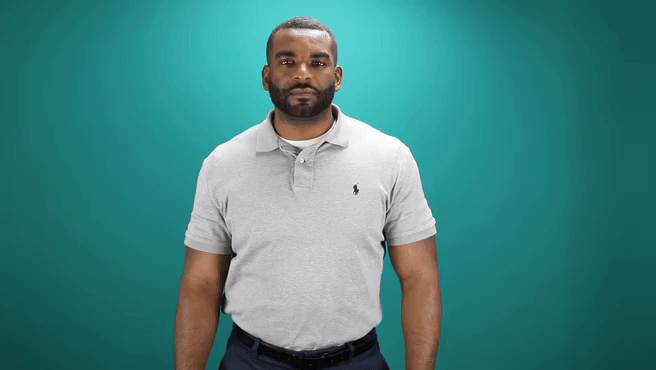
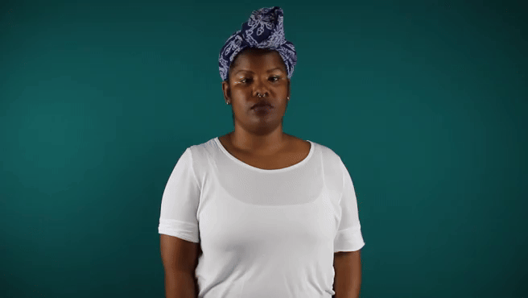
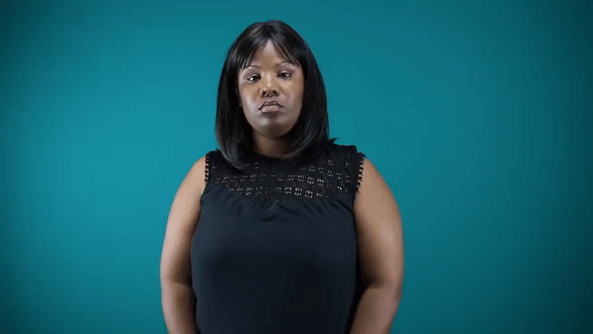
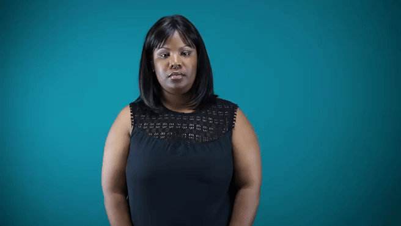
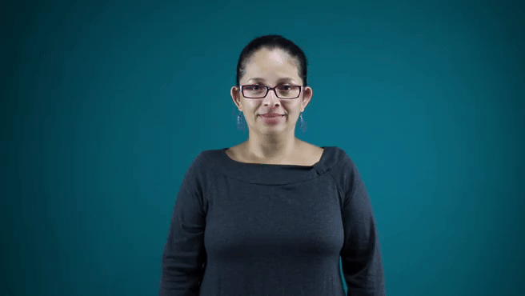
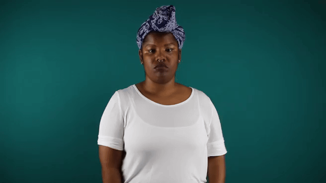
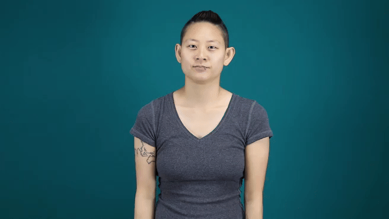
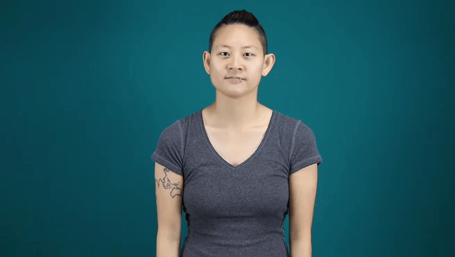
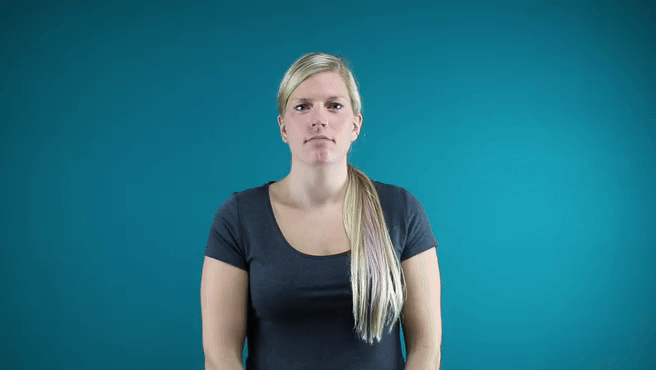

    
    
    
    
    
    
    

## Gesture: Real-time ALS Translation & Speech

The World Health Organization (WHO) reports that more than 7% of the word’s populations has hearing impairments. An estimated 900 million people will experience hearing loss in 2050. What if there was a method to facilitate communication between sign and non-sign speakers?

### Background

Sign languages are visual representations of hand gestures, finger movements, facial expression, body movements, facial expression, body movement, etc. This structure can vary spatially and temporally.

Current state-of-the-art technologies:

Glove/Sensor Based - signer wears a pair of gloves, to capture real-time hand and finger movements, for example the Leap motion sensor.

Computer Vision Based - reads the movements of the human body, typically hand movements and uses these gestures to interpret sign language. 

With the recent advances in Mixed Reality (XR), such as the Meta Quest and Apple Vision, we propose a vision-to-speech approach, integrating recognition technologies with the real-world. Imagine features where your glasses/headsets could translate sign, you could provide further accessibility on Zoom, Teams, or FaceTime. 

### Methods

For model training, I use the large-scale [Word-Level American Sign Language (WLASL)](https://github.com/dxli94/WLASL/) video dataset, containing more than 2000 words performed by over 100 signers. To my knowledge, it is by far the largest public ASL dataset to facilitate word-level sign recognition research.

1. Sign language detection on a smaller scale - capture an image and predict what letter is being signed.
2. Transfer learning on WLASL - for each video, detect the facial and hand key-points, and then predict the word being signed.

*We primarily focus on analyzing still signing as opposed to action-based signing, which also takes into account facial expressions and semantics.

### Examples
| original_video | key_point_mapping_prediction |
|----------------|------------------------------|
|  |  |
|  |  |
|  |  |
|  |  |
|  |  |
|  |  |
|  |  |
|  |  |
|  |  |
|  |  |
|  |  |

